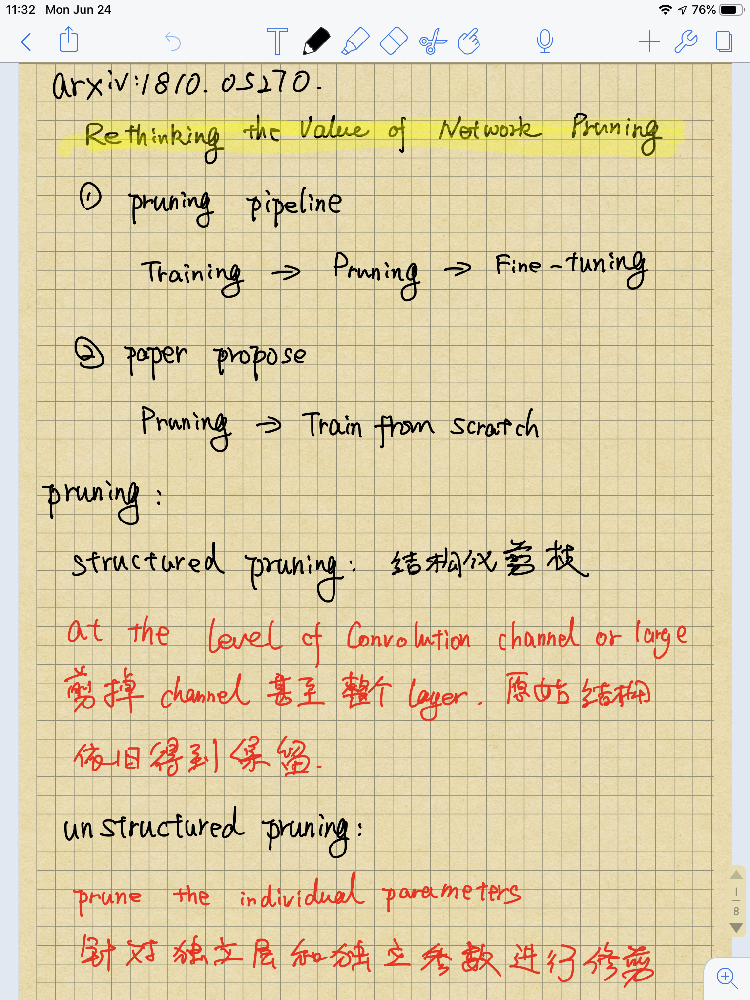
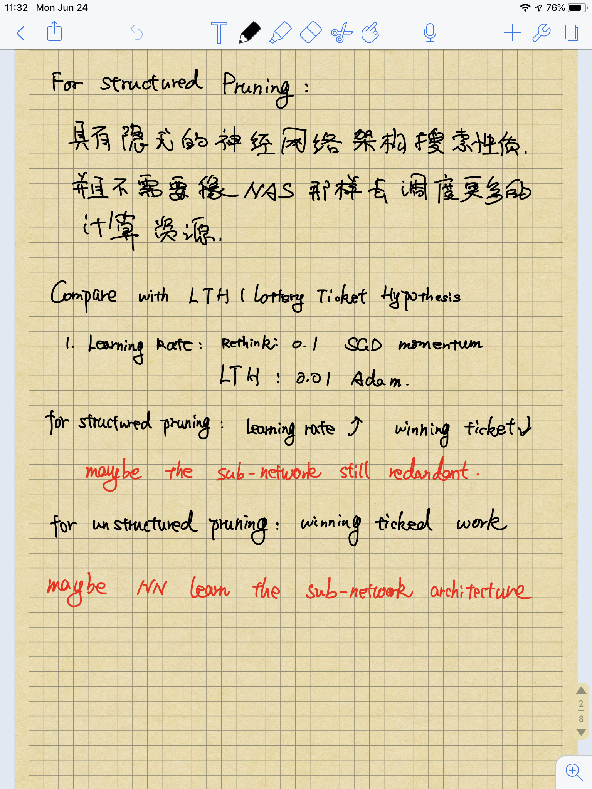
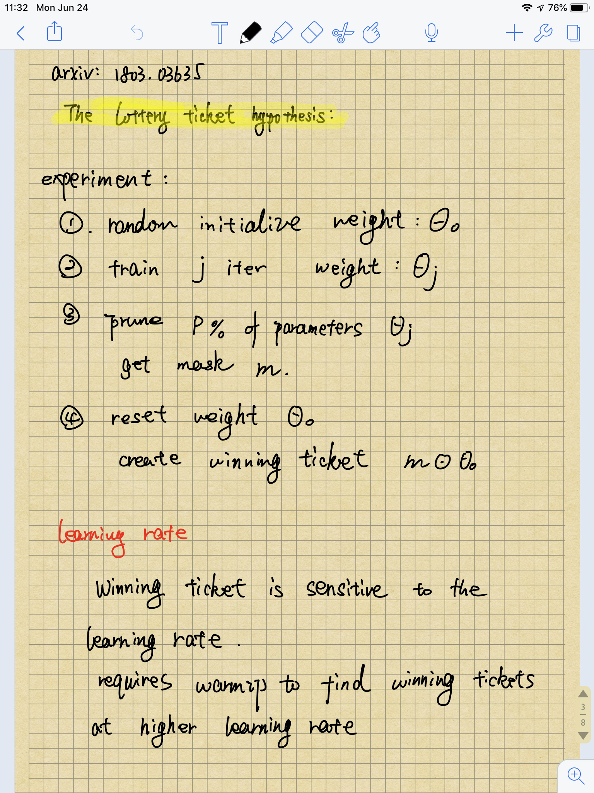
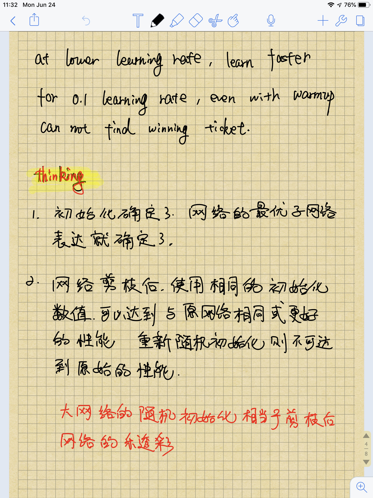
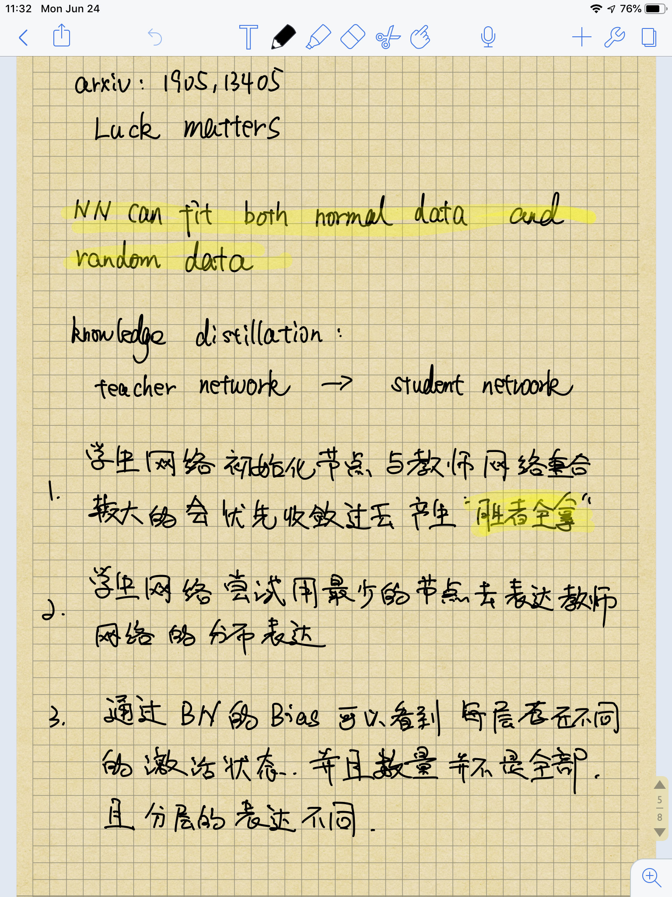
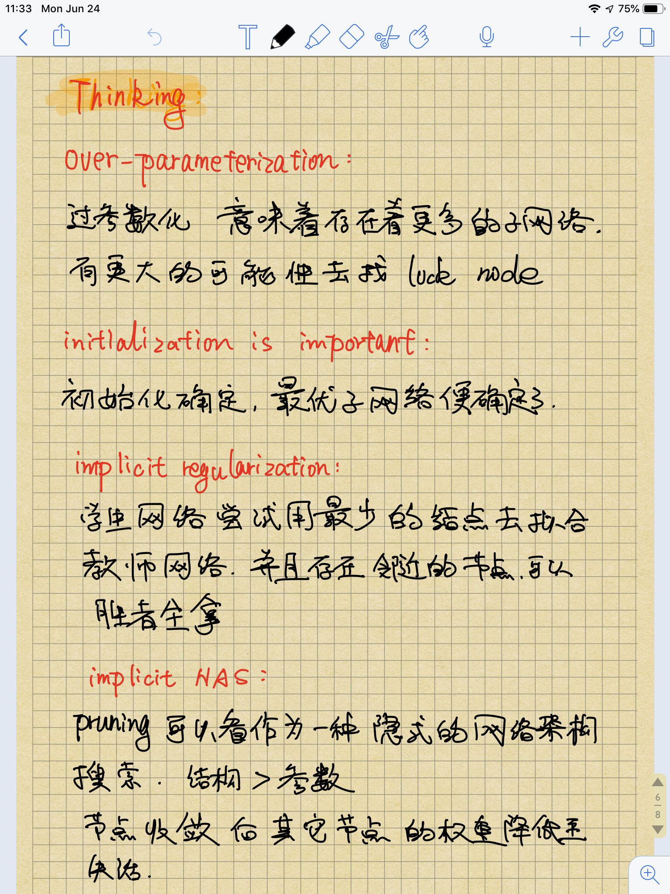
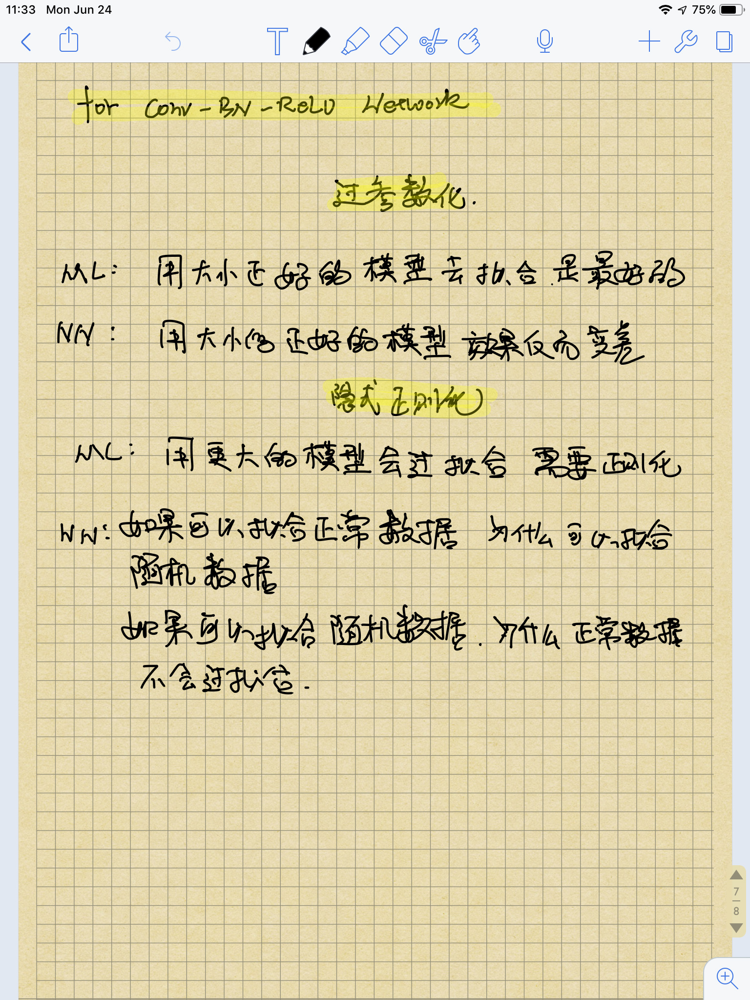

## Rethinking The Value of Network Pruning

## The Lottery Ticket Hypothesis- Finding Sparse, Trainable Neural Networks

## Luck Matters: Understanding Training Dynamics of Deep ReLU Networks

