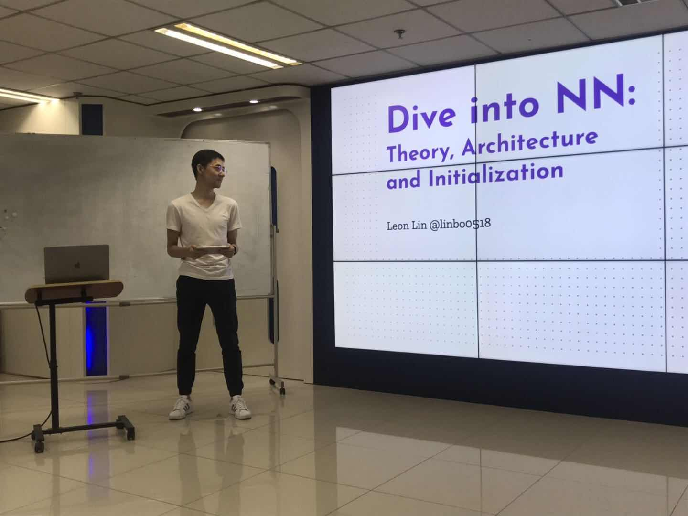

# Dive into NN: Theory, Architecture and Initialization

Oral for AI-ML-Club(`AMC` for short), for more detail about our club, check out our [GitHub](https://github.com/BUPT/ai-ml.club) and [Website](https://ai-ml.club/)

- [Dive into NN: Theory, Architecture and Initialization](#Dive-into-NN-Theory-Architecture-and-Initialization)
  - [Material](#Material)
    - [Paper](#Paper)
    - [Link](#Link)
  - [Presentation](#Presentation)
  - [Note](#Note)
  - [Thinking](#Thinking)

## Material

### Paper

- [Rethinking The Value of Network Pruning](https://arxiv.org/abs/1810.05270)
- [The Lottery Ticket Hypothesis- Finding Sparse, Trainable Neural Networks](https://arxiv.org/abs/1803.03635)
- [Luck Matters: Understanding Training Dynamics of Deep ReLU Networks](https://arxiv.org/abs/1905.13405)

<!-- - [The Benefits of Over-parameterization at Initialization in Deep ReLU Networks](https://arxiv.org/abs/1901.03611)
- [Stabilizing the Lottery Ticket Hypothesis](https://arxiv.org/abs/1903.01611)
- [How to Initialize your Network](https://arxiv.org/abs/1906.02341) -->

### Link

- [如何评价ICLR 2019最佳论文《The Lottery Ticket Hypothesis》？](https://www.zhihu.com/question/323214798)
- [求道之人，不问寒暑（三）](https://zhuanlan.zhihu.com/p/67782029)

## Presentation

You can find the full version of this slide at [Google Slide](https://docs.google.com/presentation/d/1cQqC3SRYlZypvQFtG7pvkBzYK1hMgu8HjwO5qvlX48Q/edit?usp=sharing)

## Note

See [Note](NOTE.md)

## Thinking

**Rethinking The Value of Network Pruning**

> Paper
> 
> > 1. training a large, over-parameterized model is often not necessary to obtain an efficient final model
> > 2. learned “important” weights of the large model are typically not useful for the small pruned model
> > 3. the pruned architecture itself, rather than a set of inherited “important” weights, is more crucial to the efficiency in the final model, which suggests that in some cases pruning can be useful as an architecture search paradigm
> 
> Zhihu
> 
> > 这里再总结一下paper关于LTH的实验（也包括LTH原paper的实验），就是：在unstructured pruning上，当使用小的learning rate时，winning ticket有帮助；当使用（标准的且accuracy更高的）大learning rate时，winning ticket没有帮助；在L1-norm structured pruning上，不管大小learning rate, winning ticket都没有帮助。更多讨论见我们paper的section 6。这个回答并没有想说LTH的价值不大，只是想指出可能有些其他情况它并不成立。至于为什么即使对unstructured pruning, 也只有当小learning rate的时候LTH才成立，我的一个naive的猜想是（并没有经过实验验证，轻喷），当learning rate较小时，最终训完时候的weights和original initialization时候的weights距离较小（不一定是L2 distance,可能是更抽象的），所以如果使用original initialization来对小model进行初始化，相当于leak了一些training完后的大model的信息。极端一点的话，甚至可以说，使用了winning ticket的这个小model并不是从scratch训的，而是已经某种程度上based on这个已经train了很久的大model了，所以它能train的相对好。当使用大learning rate时，训完的weights和init的相差较远，就不存在这个原因了。

**The Lottery Ticket Hypothesis- Finding Sparse, Trainable Neural Networks**

> Paper
> 
> > 1. **The Lottery Ticket Hypothesis**. A randomly-initialized, dense neural network contains a subnetwork that is initialized such that—when trained in isolation—it can match the test accuracy of the original network after training for at most the same number of iterations
> > 2. The lottery ticket hypothesis offers a complementary perspective on this relationship—that larger networks might explicitly contain simpler representations
> > 3. By this logic, overparameterized networks are easier to train because they have more combinations of subnetworks that are potential winning tickets
>
> Zhihu
> 
> > 就是说初始参数固定了，最优子网络就固定了。

**Luck Matters: Understanding Training Dynamics of Deep ReLU Networks**

> Paper
> 
> > 1. **Fitting both structured and random data.** Under gradient descent dynamics, some student nodes, which happen to overlap substantially with teacher nodes, will move into the teacher node and cover them
> > 2. **Flat minima.** Flat minima seem to be associated with good generalization, while sharp minima often lead to poor generalization
> > 3. **Implicit regularization.** On the other hand, the snapping behavior enforces winner-take-all: after optimization, a teacher node is fully covered (explained) by a few student nodes, rather than splitting amongst student nodes due to over-parameterization. This explains why the same network, once trained with structured data, can generalize to the test set.
> > 4. **Lottery Tickets.** Therefore, if we reset their weights and prune others away, they can still converge to the same set of teacher nodes, and potentially achieve better performance due to less interference with other irrelevant nodes.
> > 5. **We analyze the bias of BatchNorm layers after the convolutional layers in pre-trained VGG11/13/16/19.** We check the BatchNorm bias as these models use Linear-BatchNorm-ReLU architecture. After BatchNorm first normalizes the input data into zero mean distribution, the BatchNorm bias determines how much data pass the ReLU threshold. If the bias is negative, then a small portion of data pass ReLU gating and Assumption 3 is likely to hold. From Fig. 6, it is quite clear that the majority of BatchNorm bias parameters are negative, in particular for the top layers.
> 
> Zhihu
> 
> > 对于结构化的数据，其对应生成数据的教师网络较小，过参化得到的学生网络中的结点会优先朝着教师网络的结点收敛过去，并且初始时和教师网络结点重合较大的学生结点（也即是“幸运神经元”，lucky weights/nodes）会收敛得更快，这样就会产生“胜者全拿”的效应，最后每个教师结点可能只有几个幸运学生结点对应。对于随机数据，其对应的教师网络比较大，学生结点会各自分散向不同的教师结点收敛。这就是为什么同样大小的模型可以同时拟合两者。并且因为胜者全拿的效应，学生倾向于用最少的结点去解释教师，从而对结构数据仍然具有泛化能力。
> >
> > 从这些解释出发，大家可能猜到了，“The Lottery Ticket Hypothesis”就是因为lucky nodes/weights的缘故：保留lucky nodes而去除其它不必要的结点，不会让泛化效果变差；但若是只保留lucky nodes，并且重新初始化它们的权重，那相当于中彩者重买彩票，再中彩的概率就很小了。而过参化的目的就是让更多的人去买彩票，这样总会有几个人中彩，最终神经网络的效果，就由它们来保证了——那自然过参化程度越好，最后泛化效果越好。
> >
> > 另外，对过参化的初步分析表明，一方面lucky student weights可以收敛到对应的teacher weights，而大部分无关的student weights/nodes可能会收敛到任意的区域去——但这并不要紧，因为这些结点的上层权重会收敛到零，以减少它们对网络输出的影响。这就附带解释了为何神经网络训练后的解往往具有平坦极小值（Flat Minima）性质：对无关的学生结点而言，任意改变它们的权重，对网络输出都没有太大影响。

<!-- **The Benefits of Over-parameterization at Initialization in Deep ReLU Networks**

**Stabilizing the Lottery Ticket Hypothesis**

**How to Initialize your Network** -->
